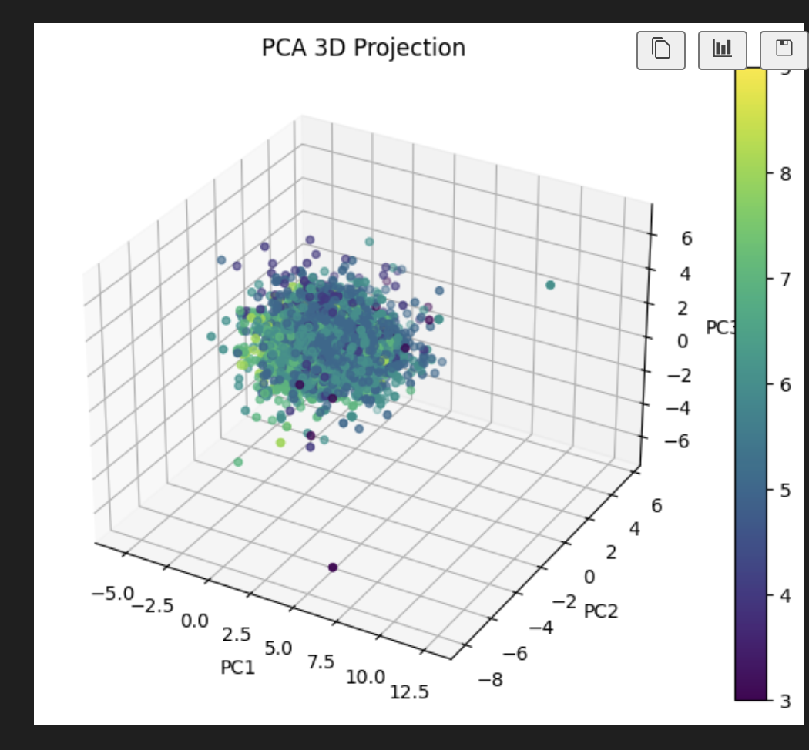
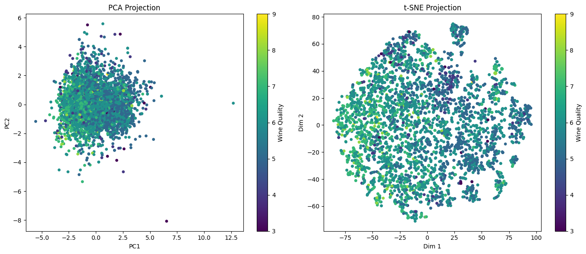

# Wine Data Dimensionality Reduction

This project demonstrates how to use **Principal Component Analysis (PCA)** and **t-Distributed Stochastic Neighbor Embedding (t-SNE)** for dimensionality reduction and visualization of high-dimensional data. In this example, we use a wine quality dataset stored in a CSV file.

## Overview

Dimensionality reduction techniques like PCA and t-SNE help in understanding and visualizing high-dimensional data. While PCA captures the global variance, t-SNE reveals local structures and clusters within the data.

## Dataset

The dataset used in this project is a wine quality dataset with the following columns (using semicolons as delimiters):
`"fixed acidity";"volatile acidity";"citric acid";"residual sugar";"chlorides";"free sulfur dioxide";"total sulfur dioxide";"density";"pH";"sulphates";"alcohol";"quality"`

## Pre-requisites

Make sure you have Python 3 installed along with the following libraries:

- `pandas`
- `numpy`
- `matplotlib`
- `scikit-learn`

You can install the required packages using pip:

`pip install pandas numpy matplotlib scikit-learn`

## Procedure

  - Step 1: Import Libraries
  - Step 2: Load the CSV Data
  - Step 3: Preprocess the Data
  - Step 4: Apply PCA
  - Step 5: Apply t-SNE
  - Step 6: Visualize the Results
- Comparison and Interpretation

## Visualization of PCA and t-SNE

### PCA 3D Scatter Plot:
   

### PCA vs t-SNE 2D Scatter Plot:
    

## Key Observations
1. PCA:
   - PCA is a linear dimensionality reduction method. It projects the data along the directions of maximum variance.
   - In our PCA results, the explained variance ratios indicate how much of the original variance is captured.
   - The 2D and 3D visualizations reveal the global structure of the data.
   - PCA is computationally efficient and helps in understanding feature importance.

2. t-SNE:
   - t-SNE is a non-linear technique that is particularly useful for visualizing local structures.
   - Our t-SNE 2D plot shows clusters of similar quality wines, which might be less evident in PCA.
   - However, t-SNE can be computationally expensive and does not preserve global distances as accurately as PCA.
   - Parameter tuning (e.g., perplexity) is critical for obtaining meaningful t-SNE visualizations.

### Trade-offs:
   - PCA is preferred when interpretability and speed are needed, especially with large datasets.
   - t-SNE is better for exploring and visualizing clusters but might distort global relationships.
   - A common approach is to use PCA for an initial reduction (e.g., to 50 dimensions) before applying t-SNE for detailed visualization.

